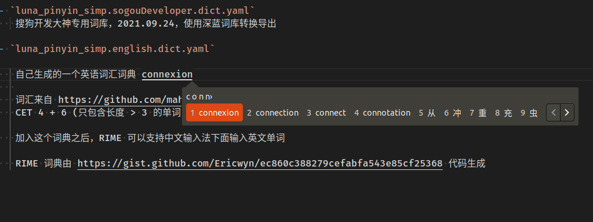

# RIME Dict
自己在 linux 下面使用 ibus-RIME 输入法时候收集的一些词典

 - `luna_pinyin_simp.sogouComputer.dict.yaml`
    搜狗计算机词汇大全，2021.09.24，使用深蓝词库转换导出

 - `luna_pinyin_simp.sogouDeveloper.dict.yaml`
    搜狗开发大神专用词库，2021.09.24，使用深蓝词库转换导出
 
 - `luna_pinyin_simp.english.dict.yaml`
    
    自己生成的一个英语词汇词典
    
    词汇来自 https://github.com/mahavivo/english-wordlists 
    CET 4 + 6 (只包含长度 > 3 的单词)，基本涵盖日常单词，默认的单词位置为 3

    加入这个词典之后，RIME 可以支持中文输入法下面输入英文单词

    RIME 词典由 https://gist.github.com/Ericwyn/ec860c388279cefabfa543e85cf25368 代码生成

    
 